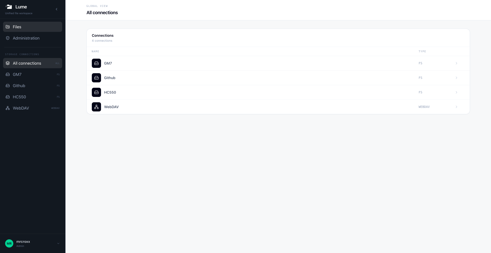
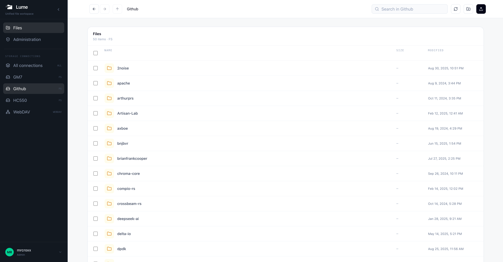
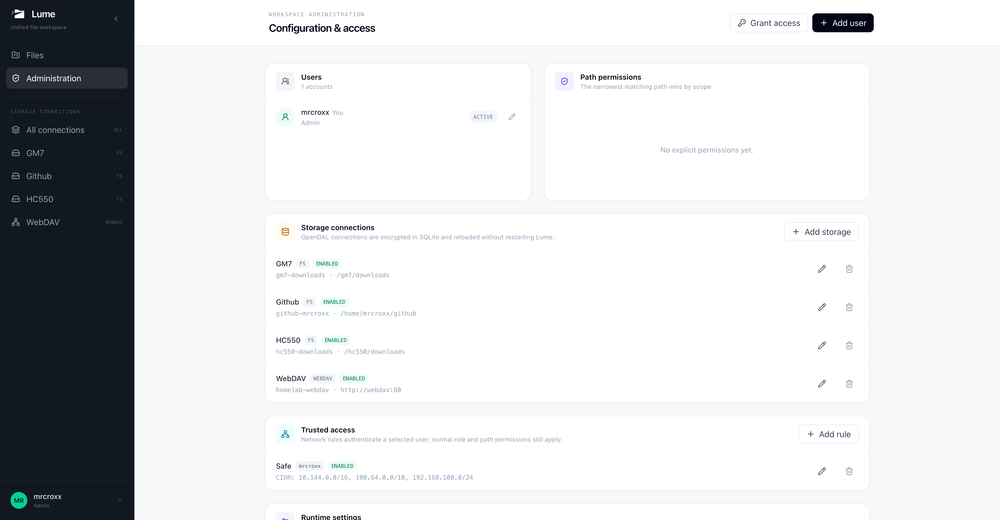

<div align="center">
  

  <p><strong>A clean, self-hosted workspace for all your files.</strong></p>
  <p>Bring local disks, NAS shares, and remote storage into one browser-based interface.</p>
</div>

Lume is a lightweight file browser built with Rust and React. It is designed for homelabs, home servers, and small self-hosted environments where storage is spread across several systems but should feel like one workspace.

## Features

- Browse all configured storage connections from one interface.
- Connect local filesystems, mounted Samba/CIFS shares, WebDAV, FTP, SFTP, and S3-compatible storage through [Apache OpenDAL](https://opendal.apache.org/).
- Search, upload, download, create directories, and remove directory trees.
- Manage users with administrator and member roles.
- Grant read, write, and management access by connection and path prefix.
- Configure users, permissions, storage connections, trusted networks, and runtime settings without restarting Lume.
- Protect credentials at rest with XChaCha20-Poly1305 encryption.

### One view for every connection

See every configured storage backend at a glance and move between them without switching tools.



### A focused file browser

Navigate, search, upload, and organize files through the same interface, regardless of the underlying storage service.



### Administration built in

Manage accounts, path-level permissions, storage connections, and trusted-access rules from the Web UI.



## Deploy with Docker

Lume publishes a container image to GitHub Container Registry. The first startup requires a non-empty administrator password. The password initializes the administrator account and is not written to the configuration file.

```bash
docker volume create lume-data

docker run -d \
  --name lume \
  --restart unless-stopped \
  -p 8080:8080 \
  -e LUME_ADMIN_PASSWORD='replace-with-a-strong-password' \
  -v lume-data:/app/data \
  ghcr.io/mrcroxx/lume:latest
```

Open `http://localhost:8080` and sign in as `admin` with the password supplied above.

To build the image locally instead:

```bash
docker build --tag lume:local .
```

Then replace `ghcr.io/mrcroxx/lume:latest` in the `docker run` command with `lume:local`.

## Deploy with Docker Compose

Create `compose.yaml`:

```yaml
services:
  lume:
    image: ghcr.io/mrcroxx/lume:latest
    container_name: lume
    restart: unless-stopped
    ports:
      - "8080:8080"
    environment:
      LUME_ADMIN_PASSWORD: "${LUME_ADMIN_PASSWORD:?set LUME_ADMIN_PASSWORD}"
    volumes:
      - lume-data:/app/data

volumes:
  lume-data:
```

Start Lume with:

```bash
export LUME_ADMIN_PASSWORD='replace-with-a-strong-password'
docker compose up -d
```

The `/app/data` volume contains both the SQLite database and Lume's default encryption key. Back up and restore them together. Do not recreate the container without persisting this directory.

### Expose host storage

To browse a directory from the Docker host, add a bind mount to the container:

```yaml
services:
  lume:
    volumes:
      - lume-data:/app/data
      - /srv/files:/storage/files
```

Then add a `Local filesystem` connection in the Administration page with `/storage/files` as its root. The directory must be accessible to UID and GID `10001`, which the container uses by default.

For Samba/CIFS, mount the share on the Docker host first and pass the mounted directory into the container. Lume deliberately avoids privileged in-container mounts and does not require `CAP_SYS_ADMIN`.

## Configuration and security

Most configuration lives in SQLite and can be changed dynamically from the Administration page:

- Users, roles, and path permissions.
- OpenDAL storage connections and their enabled state.
- Session lifetime, Secure Cookie behavior, upload limits, and trusted reverse proxies.
- Per-user trusted-access rules for selected CIDR ranges and domains.

Bootstrap settings can be supplied through environment variables:

| Variable | Default | Purpose |
| --- | --- | --- |
| `LUME_ADDRESS` | `0.0.0.0:8080` | HTTP listen address |
| `LUME_DATABASE_URL` | `sqlite:///app/data/lume.db` in Docker | SQLite database URL |
| `LUME_FRONTEND_DIST` | `/app/frontend/dist` in Docker | Built frontend directory |
| `LUME_ADMIN_USERNAME` | `admin` | Initial administrator username |
| `LUME_ADMIN_PASSWORD` | None | Initial administrator password |
| `LUME_SECRET_KEY` | None | Base64-encoded storage encryption key |
| `LUME_SECRET_KEY_FILE` | `/app/data/lume.key` in Docker | Storage encryption key file |

Storage connection definitions are encrypted in full before they are stored in SQLite. For production deployments, you can manage the master key externally through `LUME_SECRET_KEY` or `LUME_SECRET_KEY_FILE`.

Trusted-access rules bypass password verification only. Normal roles and path permissions still apply. Forwarded client addresses and hostnames are accepted only from reverse proxies explicitly trusted in Lume; those proxies must overwrite client-supplied `Host` and `X-Forwarded-For` headers.

## Development

Lume requires Rust 1.95 or later and Node.js 24 or later.

```bash
npm --prefix frontend install
npm --prefix frontend run build
LUME_ADMIN_PASSWORD='replace-with-a-strong-password' cargo run -p lume-server
```

For frontend development, run the Vite server alongside the backend:

```bash
LUME_ADMIN_PASSWORD='replace-with-a-strong-password' cargo run -p lume-server
npm --prefix frontend run dev
```

Vite proxies `/api` requests to `127.0.0.1:8080`.

Recommended validation commands:

```bash
cargo fmt --all -- --check
cargo clippy --workspace --all-targets --all-features --locked -- -D warnings
cargo test --workspace --all-features --locked
npm --prefix frontend run lint
npm --prefix frontend run build
```

## Current limitations

Recursive search is intended for small and medium-sized directory trees. Each request scans at most 50,000 entries and returns at most 500 results. Very large object stores will benefit from a dedicated indexer in a future release.

## Release channels

Lume publishes multi-platform container images for `linux/amd64` and `linux/arm64`:

- `latest` and semantic version tags such as `0.1.0` track stable releases.
- `edge` tracks the latest successful build from `main` and may contain unreleased changes.
- `sha-<commit>` identifies an immutable source revision.

Release versions and notes are prepared automatically from Conventional Commits. Merging the generated release pull request creates the version tag, publishes the container image, and publishes the GitHub Release.
